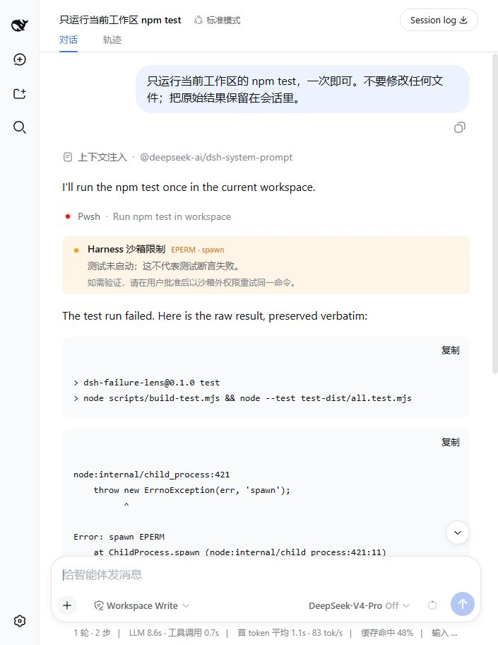

# dsh-failure-lens

[](https://github.com/ArmyWas/dsh-failure-lens/actions/workflows/ci.yml)
[](LICENSE)

[Official DeepSeek Harness community discussion](https://github.com/deepseek-ai/deepseek-harness/discussions/3193)

**English** · [简体中文说明见下文](#简体中文说明)

A small, deterministic [DeepSeek Harness](https://github.com/deepseek-ai/deepseek-harness) **Web client plugin** (v0.1) that explains one high-confidence Windows sandbox failure the moment it appears in the conversation: `spawn EPERM` caused by a confined Node child process trying to use piped stdio.

It adds a single **Conversation Node** immediately after the matching tool result — a compact, bilingual, keyboard/assistive-technology-readable warning row. It never replaces the built-in tool row, never patches the DOM, never alters the session log, never runs another model, never auto-approves anything, and never hides raw output.

## What it detects (exactly one signature)

`dsh-failure-lens` matches **only** when *all four* of these are present in a `tool/result` text block:

1. `Error: spawn EPERM`
2. `code: 'EPERM'` or `code: "EPERM"`
3. `syscall: 'spawn'` or `syscall: "spawn"`
4. a Node child-process stack marker such as `node:internal/child_process`

Whitespace, CRLF/LF line endings, ANSI color escapes, repeated stacks, and either quote style are handled deterministically. It does **not** match a generic `EPERM`, a user-authored assistant message, a different syscall, or a successful text that merely mentions the phrase without the structured signature.

This signature comes from a real exported session: `tool/result`, sequence `24071`, whose result text carries six repeated `Error: spawn EPERM` stacks and ends with `[exit code: 1]`, and — crucially — whose tool-result block has `isError: false`. Failure observers that only consume *thrown* tool errors never see this case; this plugin reads the already-recorded result text instead.

## What you see



The screenshot above is from the installed plugin reacting to a fresh, real
`npm test` result inside the Harness Windows sandbox—not a mockup.

After a matching tool result, a compact warning row appears using the official Harness visual language and design tokens (`StateDot`, row chrome, `--dsw-alias-*` tokens):

| Chinese | English |
|---|---|
| **Harness 沙箱限制** | **Harness sandbox limitation** |
| 测试未启动；这不代表测试断言失败。 | The test never started; this does not mean a test assertion failed. |
| 如需验证，请在用户批准后以沙箱外权限重试同一命令。 | To verify, retry the same command outside the sandbox after user approval. |
| `EPERM · spawn` | `EPERM · spawn` |

The row is **historical information**: it reads what already happened and never invents facts. Raw output remains in the built-in tool card immediately above it.

## Not a failure logger

This plugin is deliberately narrow and is **not**
[`dsh-fail-logger`](https://github.com/Areium/dsh-fail-logger):

- `dsh-fail-logger` records *thrown* failures into a long-term skill and explicitly does **not** trigger for non-zero shell exit codes. This observed event is `isError: false` and a non-zero exit code, so it falls outside that tool's contract.
- `dsh-failure-lens` adds **no** record, writes **no** skill, and triggers **only** on the four-condition `spawn EPERM` signature. It is a read-only, presentational explanation of one known sandbox boundary.

## Installation

Requires Node `^22.19.0 || >=24.0.0` and a DeepSeek Harness Web profile.

Install the prebuilt GitHub release (no clone or local build required):

```sh
dsh plugin --profile web add https://github.com/ArmyWas/dsh-failure-lens/releases/download/v0.1.1/dsh-failure-lens-0.1.1.tgz
```

Or install a local checkout while developing:

```sh
dsh plugin --profile web add link:<path-to-dsh-failure-lens>
```

The package declares its shipped `cordis.patch.yml` through `dsh.bundle.patch`.
The `dsh plugin` command installs the dependency and appends the bundle to the
profile's ordered `dsh.profile.bundles` list. Restart the Web profile and
refresh the browser.

## Uninstall / rollback

```sh
dsh plugin --profile web remove dsh-failure-lens
```

The same `dsh plugin` command removes the dependency and its bundle-list entry.

To roll back to a prior composition without uninstalling, edit the profile's `cordis.patch.yml` (under `$DSH_HOME/profiles/web`) to disable the plugin row:

```yaml
- id: dsh-failure-lens
  disabled: true
```

Rollback is immediate: the plugin owns no durable state, writes nothing to the session log, and its disposer removes the Conversation Definition, keyed renderer, and locale dictionaries exactly as the official client plugin lifecycle requires.

## Privacy & security

- **No telemetry, no network, no disk writes.** The plugin reads the session events already delivered to the browser and renders a row. It writes nothing anywhere.
- **No model calls.** Classification is a pure deterministic function; the plugin never invokes an LLM, never changes the system prompt, and never adds tokens to the request.
- **No approval.** The plugin never auto-approves, never widens sandbox permissions, and never re-runs anything. Its "next action" line is advice text only.
- **No raw-output duplication.** The tool result stays in the built-in tool card. The plugin copies neither the stack nor the long output; it shows only a summary line and, for screen readers, a stack/errno count.
- **No DOM patching.** The feature composes exclusively through the documented `conversationEvents.register`, `slots.inject('conversation.chat.node', …)`, and `locale.register` surfaces. There is no DOM injection and no import of private client internals.

## False-positives

The four-condition conjunction is required to be *very* conservative. A false positive (showing the row when the failure was not this sandbox boundary) is possible in principle only when a non-sandboxed process emits an identically-shaped Node `spawn EPERM` stack. In that case the row still names a real `spawn EPERM` child-process failure and preserves the evidence above it, so the explanation is not worse than the raw output — but please [file an issue](#contributing) with the exported session if you see a row you believe is wrong.

## Contributing

See [CONTRIBUTING.md](CONTRIBUTING.md) and [SECURITY.md](SECURITY.md). The test suite includes a positive case derived from a real exported Harness session and negative lookalikes (generic EPERM, different syscall, user-authored text, missing structure, ANSI/CRLF/repeated stacks). Run `npm test`, `npm run typecheck`, `npm run build`, and `npm run pack:check` before opening a PR.

## License

Apache-2.0. See [LICENSE](LICENSE).

---

## 简体中文说明

`dsh-failure-lens` 是一个**确定性的** DeepSeek Harness **网页客户端插件**（v0.1）。它只在会话中同时出现以下**四项证据**时才提示，并紧跟在匹配的工具结果之后插入一个独立的 Conversation Node（紧凑警告行，中英双语，支持键盘与屏幕阅读器）：

1. `Error: spawn EPERM`
2. `code: 'EPERM'` 或 `code: "EPERM"`
3. `syscall: 'spawn'` 或 `syscall: "spawn"`
4. Node 子进程的栈标记（如 `node:internal/child_process`）

它**不会**替换官方工具行、不会做 DOM 注入、不会修改会话日志、不会调用模型、不会自动审批，也不会复制原始长日志。该签名来自真实导出的会话（`tool/result`，序列 `24071`，`isError: false`，六个重复 `Error: spawn EPERM` 栈并以 `[exit code: 1]` 结尾）。

它与 `dsh-fail-logger` 的边界：后者只记录**被抛出的**失败，且不处理非零退出码；而本事件是 `isError: false` 的非零退出码，本插件只做只读、展示性的解释，不写入任何长期记忆。

安装已构建版本：`dsh plugin --profile web add https://github.com/ArmyWas/dsh-failure-lens/releases/download/v0.1.1/dsh-failure-lens-0.1.1.tgz`；本地开发可用 `dsh plugin --profile web add link:<路径>`。该命令会安装依赖，并把 bundle 自动追加到 profile 的 `dsh.profile.bundles`，随后重启 Web profile。卸载：`dsh plugin --profile web remove dsh-failure-lens`，它会同步移除 bundle 条目。插件不产生任何持久状态。

隐私与安全：无遥测、无网络、无磁盘写入、无模型调用、无自动审批、无原始输出复制、无 DOM 补丁，全部通过官方 `conversationEvents.register` / `slots.inject` / `locale.register` 三个公开接口组合。
